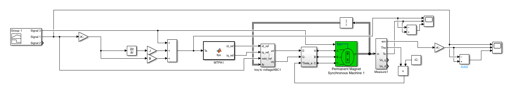

# SDRE_Simulink
This code using Matlab\Simulink to simulate SDRE control use in robot legs system and single motor

#single motor simulate

The simulation result graph in this text is divided into 3 layers: layer 1 is the target trajectory,
 layer 2 is the return trajectory of the motor, and layer 3 is the absolute error of the target trajec
tory and the return trajectory

